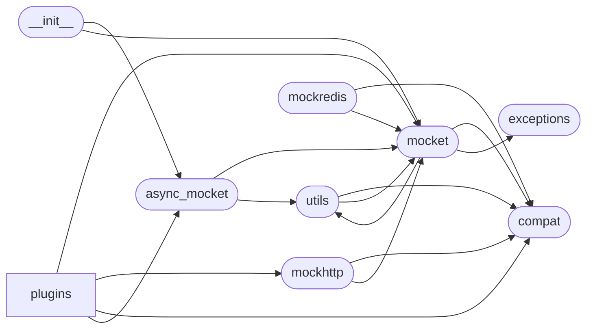

# Code Overview

[_Documentation generated by Documatic_](https://www.documatic.com)

<!---Documatic-section-Codebase Structure Python-start--->
## Codebase Structure Python

The codebase has a 2-deep folder structure,
                with 12 code files in total.

<!---Documatic-block-system_architecture-start--->

<!---Documatic-block-system_architecture-end--->

# #
<!---Documatic-section-Codebase Structure Python-end--->

<!---Documatic-section-Key Objects-start--->
## Key Objects

There are exposed imports at level-0
from the source directory (mocket)

<!---Documatic-block-mocke-start--->

	
<code>mocke</code> (Click to Expand!)

* `mocket.async_mocket.async_mocketize`
* `mocket.mocket.Mocket`
* `mocket.mocket.MocketEntry`
* `mocket.mocket.Mocketizer`
* `mocket.mocket.mocketize`

<!---Documatic-block-mocke-end--->

# #
<!---Documatic-section-Key Objects-end--->

<!---Documatic-section-Important Functions-start--->
## Important Functions

<!---Documatic-block-important_funcs-start--->
<!---Documatic-block-most_used_funcs-start--->
### Most Utilised Functions

* [mocket.compat.decode_from_bytes](4-mocket_compat.md#mocket.compat.decode_from_bytes) (5 times)
* [mocket.compat.encode_to_bytes](4-mocket_compat.md#mocket.compat.encode_to_bytes) (4 times)
* mocket.compat.byte_type (3 times)
* mocket.compat.text_type (3 times)
* [mocket.utils.get_mocketize](3-mocket_utils.md#mocket.utils.get_mocketize) (2 times)
* mocket.async_mocket.async_mocketize (2 times)
* mocket.mocket.mocketize (2 times)
* [mocket.compat.do_the_magic](4-mocket_compat.md#mocket.compat.do_the_magic) (1 times)
* [mocket.compat.shsplit](4-mocket_compat.md#mocket.compat.shsplit) (1 times)
* mocket.compat.basestring (1 times)
* [mocket.utils.hexdump](3-mocket_utils.md#mocket.utils.hexdump) (1 times)
* [mocket.utils.hexload](3-mocket_utils.md#mocket.utils.hexload) (1 times)
<!---Documatic-block-most_used_funcs-end--->

<!---Documatic-block-end_user_funcs-start--->
### End User Exposed Functions

* [mocket.mocket.Mocketizer](5-mocket_mocket.md#mocket.mocket.Mocketizer)
* mocket.async_mocket.async_mocketize
* [mocket.mocket.Mocket](5-mocket_mocket.md#mocket.mocket.Mocket)
* [mocket.mocket.MocketEntry](5-mocket_mocket.md#mocket.mocket.MocketEntry)
* mocket.mocket.mocketize
<!---Documatic-block-end_user_funcs-end--->
<!---Documatic-block-important_funcs-end--->

# #
<!---Documatic-section-Important Functions-end--->

<!---Documatic-section-File IO-start--->
## File IO

<!---Documatic-block-file_io-start--->
The following files have file read operations

<!---Documatic-block-mocket-start--->

	
<code>mocket</code> (Click to Expand!)

* mocket.compat
* mocket.mocket

<!---Documatic-block-mocket-end--->
<!---Documatic-block-file_io-end--->

# #
<!---Documatic-section-File IO-end--->

[_Documentation generated by Documatic_](https://www.documatic.com)