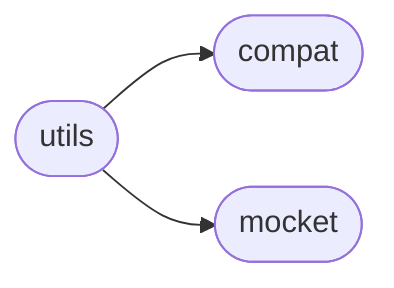
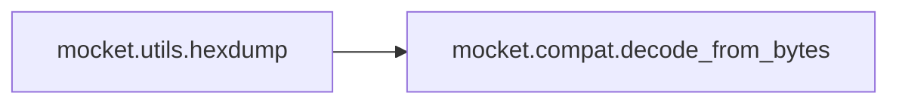

# Mocket Utils

[_Documentation generated by Documatic_](https://www.documatic.com)

<!---Documatic-section-Codebase Structure-start--->
## Codebase Structure

<!---Documatic-block-system_architecture-start--->

<!---Documatic-block-system_architecture-end--->

# #
<!---Documatic-section-Codebase Structure-end--->

<!---Documatic-section-mocket.utils.get_mocketize-start--->
## [mocket.utils.get_mocketize](3-mocket_utils.md#mocket.utils.get_mocketize)

<!---Documatic-section-get_mocketize-start--->
<!---Documatic-block-mocket.utils.get_mocketize-start--->
<details>
	<summary><code>mocket.utils.get_mocketize</code> code snippet</summary>

```python
def get_mocketize(wrapper_):
    import decorator
    if decorator.__version__ < '5':
        return decorator.decorator(wrapper_)
    return decorator.decorator(wrapper_, kwsyntax=True)
```
</details>
<!---Documatic-block-mocket.utils.get_mocketize-end--->
<!---Documatic-section-get_mocketize-end--->

# #
<!---Documatic-section-mocket.utils.get_mocketize-end--->

<!---Documatic-section-mocket.utils.hexdump-start--->
## [mocket.utils.hexdump](3-mocket_utils.md#mocket.utils.hexdump)

<!---Documatic-section-hexdump-start--->


### Object Calls

* [mocket.compat.decode_from_bytes](4-mocket_compat.md#mocket.compat.decode_from_bytes)

<!---Documatic-block-mocket.utils.hexdump-start--->
<details>
	<summary><code>mocket.utils.hexdump</code> code snippet</summary>

```python
def hexdump(binary_string):
    bs = decode_from_bytes(binascii.hexlify(binary_string).upper())
    return ' '.join((a + b for (a, b) in zip(bs[::2], bs[1::2])))
```
</details>
<!---Documatic-block-mocket.utils.hexdump-end--->
<!---Documatic-section-hexdump-end--->

# #
<!---Documatic-section-mocket.utils.hexdump-end--->

<!---Documatic-section-mocket.utils.hexload-start--->
## [mocket.utils.hexload](3-mocket_utils.md#mocket.utils.hexload)

<!---Documatic-section-hexload-start--->


### Object Calls

* [mocket.compat.encode_to_bytes](4-mocket_compat.md#mocket.compat.encode_to_bytes)

<!---Documatic-block-mocket.utils.hexload-start--->
<details>
	<summary><code>mocket.utils.hexload</code> code snippet</summary>

```python
def hexload(string):
    string_no_spaces = ''.join(string.split())
    return encode_to_bytes(binascii.unhexlify(string_no_spaces))
```
</details>
<!---Documatic-block-mocket.utils.hexload-end--->
<!---Documatic-section-hexload-end--->

# #
<!---Documatic-section-mocket.utils.hexload-end--->

[_Documentation generated by Documatic_](https://www.documatic.com)