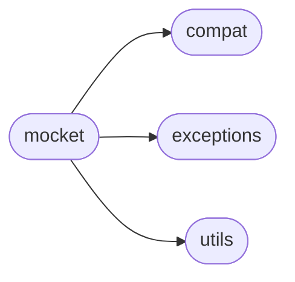

# Mocket Mocket

[_Documentation generated by Documatic_](https://www.documatic.com)

<!---Documatic-section-Codebase Structure-start--->
## Codebase Structure

<!---Documatic-block-system_architecture-start--->

<!---Documatic-block-system_architecture-end--->

# #
<!---Documatic-section-Codebase Structure-end--->

<!---Documatic-section-mocket.mocket.Mocketizer-start--->
## [mocket.mocket.Mocketizer](5-mocket_mocket.md#mocket.mocket.Mocketizer)

<!---Documatic-section-Mocketizer-start--->
<!---Documatic-block-mocket.mocket.Mocketizer-start--->
<details>
	<summary><code>mocket.mocket.Mocketizer</code> code snippet</summary>

```python
class Mocketizer:

    def __init__(self, instance=None, namespace=None, truesocket_recording_dir=None, strict_mode=False):
        self.instance = instance
        self.truesocket_recording_dir = truesocket_recording_dir
        self.namespace = namespace or text_type(id(self))
        MocketMode().STRICT = strict_mode

    def enter(self):
        Mocket.enable(namespace=self.namespace, truesocket_recording_dir=self.truesocket_recording_dir)
        if self.instance:
            self.check_and_call('mocketize_setup')

    def __enter__(self):
        self.enter()
        return self

    def exit(self):
        if self.instance:
            self.check_and_call('mocketize_teardown')
        Mocket.disable()

    def __exit__(self, type, value, tb):
        self.exit()

    async def __aenter__(self, *args, **kwargs):
        self.enter()
        return self

    async def __aexit__(self, *args, **kwargs):
        self.exit()

    def check_and_call(self, method_name):
        method = getattr(self.instance, method_name, None)
        if callable(method):
            method()

    @staticmethod
    def factory(test, truesocket_recording_dir, strict_mode, args):
        instance = args[0] if args else None
        namespace = None
        if truesocket_recording_dir:
            namespace = '.'.join((instance.__class__.__module__, instance.__class__.__name__, test.__name__))
        return Mocketizer(instance, namespace=namespace, truesocket_recording_dir=truesocket_recording_dir, strict_mode=strict_mode)
```
</details>
<!---Documatic-block-mocket.mocket.Mocketizer-end--->
<!---Documatic-section-Mocketizer-end--->

# #
<!---Documatic-section-mocket.mocket.Mocketizer-end--->

<!---Documatic-section-mocket.mocket.Mocket-start--->
## [mocket.mocket.Mocket](5-mocket_mocket.md#mocket.mocket.Mocket)

<!---Documatic-section-Mocket-start--->
<!---Documatic-block-mocket.mocket.Mocket-start--->
<details>
	<summary><code>mocket.mocket.Mocket</code> code snippet</summary>

```python
class Mocket:
    _entries = collections.defaultdict(list)
    _requests = []
    _namespace = text_type(id(_entries))
    _truesocket_recording_dir = None
    r_fd = None
    w_fd = None

    @classmethod
    def register(cls, *entries):
        for entry in entries:
            cls._entries[entry.location].append(entry)

    @classmethod
    def get_entry(cls, host, port, data):
        host = host or Mocket._address[0]
        port = port or Mocket._address[1]
        entries = cls._entries.get((host, port), [])
        for entry in entries:
            if entry.can_handle(data):
                return entry

    @classmethod
    def collect(cls, data):
        cls.request_list().append(data)

    @classmethod
    def reset(cls):
        cls.r_fd = None
        cls.w_fd = None
        cls._entries = collections.defaultdict(list)
        cls._requests = []

    @classmethod
    def last_request(cls):
        if cls.has_requests():
            return cls.request_list()[-1]

    @classmethod
    def request_list(cls):
        return cls._requests

    @classmethod
    def remove_last_request(cls):
        if cls.has_requests():
            del cls._requests[-1]

    @classmethod
    def has_requests(cls):
        return bool(cls.request_list())

    @staticmethod
    def enable(namespace=None, truesocket_recording_dir=None):
        Mocket._namespace = namespace
        Mocket._truesocket_recording_dir = truesocket_recording_dir
        if truesocket_recording_dir:
            if not os.path.isdir(truesocket_recording_dir):
                raise AssertionError
        socket.socket = socket.__dict__['socket'] = MocketSocket
        socket._socketobject = socket.__dict__['_socketobject'] = MocketSocket
        socket.SocketType = socket.__dict__['SocketType'] = MocketSocket
        socket.create_connection = socket.__dict__['create_connection'] = create_connection
        socket.gethostname = socket.__dict__['gethostname'] = lambda : 'localhost'
        socket.gethostbyname = socket.__dict__['gethostbyname'] = lambda host: '127.0.0.1'
        socket.getaddrinfo = socket.__dict__['getaddrinfo'] = lambda host, port, family=None, socktype=None, proto=None, flags=None: [(2, 1, 6, '', (host, port))]
        socket.socketpair = socket.__dict__['socketpair'] = socketpair
        ssl.wrap_socket = ssl.__dict__['wrap_socket'] = FakeSSLContext.wrap_socket
        ssl.SSLContext = ssl.__dict__['SSLContext'] = FakeSSLContext
        socket.inet_pton = socket.__dict__['inet_pton'] = lambda family, ip: byte_type('\x7f\x00\x00\x01', 'utf-8')
        urllib3.util.ssl_.wrap_socket = urllib3.util.ssl_.__dict__['wrap_socket'] = FakeSSLContext.wrap_socket
        urllib3.util.ssl_.ssl_wrap_socket = urllib3.util.ssl_.__dict__['ssl_wrap_socket'] = FakeSSLContext.wrap_socket
        urllib3.connection.ssl_wrap_socket = urllib3.connection.__dict__['ssl_wrap_socket'] = FakeSSLContext.wrap_socket
        urllib3.connection.match_hostname = urllib3.connection.__dict__['match_hostname'] = lambda cert, hostname: None
        if pyopenssl_override:
            extract_from_urllib3()

    @staticmethod
    def disable():
        socket.socket = socket.__dict__['socket'] = true_socket
        socket._socketobject = socket.__dict__['_socketobject'] = true_socket
        socket.SocketType = socket.__dict__['SocketType'] = true_socket
        socket.create_connection = socket.__dict__['create_connection'] = true_create_connection
        socket.gethostname = socket.__dict__['gethostname'] = true_gethostname
        socket.gethostbyname = socket.__dict__['gethostbyname'] = true_gethostbyname
        socket.getaddrinfo = socket.__dict__['getaddrinfo'] = true_getaddrinfo
        socket.socketpair = socket.__dict__['socketpair'] = true_socketpair
        ssl.wrap_socket = ssl.__dict__['wrap_socket'] = true_ssl_wrap_socket
        ssl.SSLContext = ssl.__dict__['SSLContext'] = true_ssl_context
        socket.inet_pton = socket.__dict__['inet_pton'] = true_inet_pton
        urllib3.util.ssl_.wrap_socket = urllib3.util.ssl_.__dict__['wrap_socket'] = true_urllib3_wrap_socket
        urllib3.util.ssl_.ssl_wrap_socket = urllib3.util.ssl_.__dict__['ssl_wrap_socket'] = true_urllib3_ssl_wrap_socket
        urllib3.connection.ssl_wrap_socket = urllib3.connection.__dict__['ssl_wrap_socket'] = true_urllib3_ssl_wrap_socket
        urllib3.connection.match_hostname = urllib3.connection.__dict__['match_hostname'] = true_urllib3_match_hostname
        Mocket.reset()
        if pyopenssl_override:
            inject_into_urllib3()

    @classmethod
    def get_namespace(cls):
        return cls._namespace

    @classmethod
    def get_truesocket_recording_dir(cls):
        return cls._truesocket_recording_dir

    @classmethod
    def assert_fail_if_entries_not_served(cls):
        """Mocket checks that all entries have been served at least once."""
        if not all((entry._served for entry in itertools.chain(*cls._entries.values()))):
            raise AssertionError('Some Mocket entries have not been served')
```
</details>
<!---Documatic-block-mocket.mocket.Mocket-end--->
<!---Documatic-section-Mocket-end--->

# #
<!---Documatic-section-mocket.mocket.Mocket-end--->

<!---Documatic-section-mocket.mocket.MocketEntry-start--->
## [mocket.mocket.MocketEntry](5-mocket_mocket.md#mocket.mocket.MocketEntry)

<!---Documatic-section-MocketEntry-start--->
<!---Documatic-block-mocket.mocket.MocketEntry-start--->
<details>
	<summary><code>mocket.mocket.MocketEntry</code> code snippet</summary>

```python
class MocketEntry:

    class Response(byte_type):

        @property
        def data(self):
            return self
    response_index = 0
    request_cls = byte_type
    response_cls = Response
    responses = None
    _served = None

    def __init__(self, location, responses):
        self._served = False
        self.location = location
        if not isinstance(responses, collections_abc.Iterable) or isinstance(responses, basestring):
            responses = [responses]
        if not responses:
            self.responses = [self.response_cls(encode_to_bytes(''))]
        else:
            self.responses = []
            for r in responses:
                if isinstance(r, BaseException):
                    pass
                elif not getattr(r, 'data', False):
                    if isinstance(r, text_type):
                        r = encode_to_bytes(r)
                    r = self.response_cls(r)
                self.responses.append(r)

    @staticmethod
    def can_handle(data):
        return True

    def collect(self, data):
        req = self.request_cls(data)
        Mocket.collect(req)

    def get_response(self):
        response = self.responses[self.response_index]
        if self.response_index < len(self.responses) - 1:
            self.response_index += 1
        self._served = True
        if isinstance(response, BaseException):
            raise response
        return response.data
```
</details>
<!---Documatic-block-mocket.mocket.MocketEntry-end--->
<!---Documatic-section-MocketEntry-end--->

# #
<!---Documatic-section-mocket.mocket.MocketEntry-end--->

[_Documentation generated by Documatic_](https://www.documatic.com)